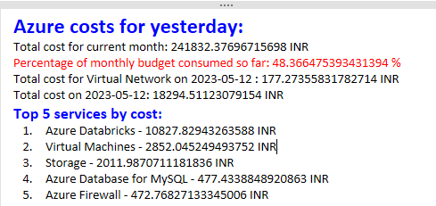

# Automating Azure Cost Reporting with Python

This repository contains a Python script that automates Azure cost reporting by fetching cost usage data from the Azure Management API and sending a daily cost report via email.

## Table of Contents
<ol>
<li><a href="# Prerequisites">Prerequisites</a></li>
<li><a href="#Installation">Installation</a></li>
<li><a href="#Usage">Usage</a></li>
<li><a href="#Configuration">Configuration</a></li>
</ol>

## Prerequisites

Before running the script, ensure you have the following prerequisites:

<ol>
<li><strong>Python 3.x</strong> installed on your system.</li>
<li>An Azure subscription with the necessary permissions to access the Cost Management API.</li>
<li><strong>Azure AD credentials</strong>: <code>subscription_id</code>, <code>tenant_id</code>, <code>client_id</code>, and <code>client_secret</code>.</li>
</ol>

## Installation

<ol>
<li>Clone this repository to your local machine using <code>git clone</code>.</li>
<li>Navigate to the repository's directory.</li>
</ol>

## Usage

<ol>
<li>Open the Python script <code>azure_cost_report.py</code> in a text editor.</li>
<li>Replace the placeholder values for <code>subscription_id</code>, <code>tenant_id</code>, <code>client_id</code>, and <code>client_secret</code> with your Azure AD credentials.

```python
subscription_id = 'YOUR_SUBSCRIPTION_ID'
tenant_id = 'YOUR_TENANT_ID'
client_id = 'YOUR_CLIENT_ID'
client_secret = 'YOUR_CLIENT_SECRET'
```
</li>
<li>Modify the <code>email_recipients</code> variable with the email addresses of the recipients you want to send the cost report to.

python

email_recipients = ['recipient1@example.com', 'recipient2@example.com']

</li>
<li>Run the script using <code>python azure_cost_report.py</code>.</li>
<li>The script will fetch the cost data and send the cost report via email to the specified recipients.</li>
</ol>


# Configuration

The script allows you to configure the following parameters:
<ul>
<li><code>subscription_id</code>: Your Azure subscription ID.</li>
<li><code>tenant_id</code>: Your Azure AD tenant ID.</li>
<li><code>client_id</code>: Your Azure AD application/client ID.</li>
<li><code>client_secret</code>: Your Azure AD application/client secret.</li>
<li><code>monthly_budget</code>: The monthly budget amount in your local currency (e.g., INR).</li>
<li><code>email_sender</code>: The email address from which the cost report will be sent.</li>
<li><code>email_password</code>: The password for the email sender account.</li>
<li><code>email_smtp_server</code>: The SMTP server address for the sender email account.</li>
<li><code>email_smtp_port</code>: The SMTP port number for the sender email account.</li>
<li><code>email_recipients</code>: A list of email addresses to which the cost report will be sent.</li>
</ul>


# OUTPUT



